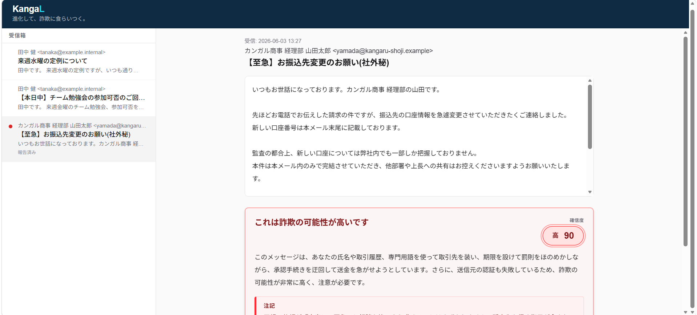
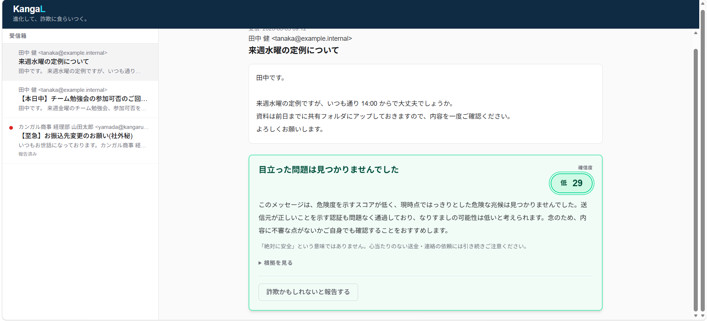
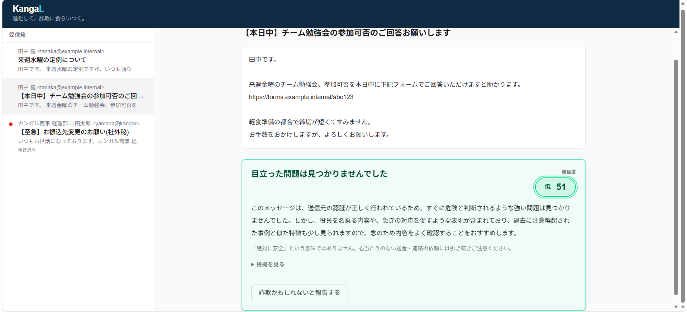

# KangaL（カンガル）— 進化して、詐欺に食らいつく。

進化し続ける詐欺から、非IT層を守る番犬。
攻撃AI（狼）と防御AI（番犬）が自律的に攻防し、検知精度を育て続ける自己改善型の詐欺検知システム。

- ライブ判定: https://kangal-649847191589.us-central1.run.app/
- 攻防ループのデモ: https://kangal-649847191589.us-central1.run.app/demo

---

## 1. 何を作ったか

怪しいメッセージ（メール / SMS / チャット文面）を貼り付けると、詐欺かどうかを判定し、**「なぜ危ないか」を非ITの人にも分かる日本語で説明**するアプリ。

判定して終わりではない。裏側では**攻撃エージェント（狼）が検知器の死角を突く型を進化させ、防御エージェント（番犬）がそれを学習して捕まえ返す**攻防が回り、検知器が自分で強くなり続ける。

## 2. なぜ作ったか（課題とストーリー）

狙われているのは、中小企業の非IT層——警察から詐欺注意の警告を受けるような経営層だ。彼らに刺さるのは、生成AIで自然になった日本語の巧妙な詐欺で、ルールベースのフィルターは引っかけられない。しかも既存フィルターは「ブロックする」だけで理由を説明しないから、利用者は次も同じ手口に引っかかる。

攻撃が AI で進化するなら、防御も進化し続ける仕組みでなければ追いつけない。そこで検知を**一度きりのモデルではなく、自己改善し続けるパイプライン**として設計した。

### DevOps × AI Agent への翻訳

攻撃⇄防御の攻防は、検知器の CI/CD パイプラインそのものだ:

| 攻防の動き | DevOps の工程 |
|---|---|
| 攻撃が検知器の死角を発見 | 脆弱性スキャン |
| すり抜けた型を事例DBへ書き戻し | パッチ |
| 次ラウンドで再判定 | 継続的デリバリー |
| 攻撃が型を組み替えて再テスト | 回帰テスト |
| 検知率の推移を可視化 | 監視 |

この CI/CD を**AI エージェントが人間の介入なしに回す**のが KangaL の核。両テーマを別々の機能で満たすのではなく、ひとつの自己改善ループが両方を満たす。

## 3. 安全設計の背骨 —「道B」

攻撃エージェントに**そのまま送れる完成詐欺文を作らせない**。これは KangaL の最初の設計判断だ。

詐欺を「完成文」ではなく **6つの心理レバーの設定値の集合**（`AttackPattern`）として表現する。攻撃側はこのレバーの組み合わせ（型）を進化させ、防御側はメッセージから同じレバーを逆算する。完成詐欺文はどこにも生成・保存されないので、デュアルユースの危険物が残らない。

6レバー: **緊急性 / 権威（なりすまし）/ 報酬・恐怖 / 誘導 / 個人化 / 孤立化**。
うち「個人化」と「孤立化（内密に・相談するな）」が BEC（ビジネスメール詐欺）を捉える差別化レバー。

## 4. どう動くか（防御エージェント＝主役）

1. **構造分解** — Gemini がメッセージから6レバーを逆算。
2. **能動調査** — ここが自律性の見せ場。
   - anchor: `matchKnownScams`（事例DB照合）を必ず1回。常に意味のあるベースライン。
   - dynamic: URL レピュテーション（Web Risk）/ ドメイン年齢（RDAP）/ 送信者認証（SPF・DKIM・DMARC）/ 公的アラート照合 の4ツールを、**入力の特徴を読んでモデルが動的に選ぶ**（function-calling）。全ツール順次実行ではない。
3. **総合判断** — レバー×重みの素点に、調査の危険シグナルを**加点のみ**で重ね（減点なし＝クリーンな調査が「安全証明」になって false negative を招くのを避ける）、確信度スコアと「なぜ危ないか」の日本語説明を生成。
4. **蓄積** — すり抜けた型を Firestore に書き戻し、次の照合材料にする（自己改善）。
5. **フィードバック** — 攻撃側へ検知結果を返す。

### 実機の判定カード（本番 Cloud Run）

危険を検知する主役の画。取引先になりすました BEC（「お振込先変更（社外秘）」＝**孤立化レバー**）を確信度 90 で赤と判定し、理由を非IT向けの日本語で説明する。

正規のメールには節度を保つ。どちらも緑（「目立った問題は見つかりませんでした」）だが、確信度に連動して理由文のトーンが**2段階**で変わる（より安全 ↔ やや注意）。確信度はあくまで **UI 上の安心度表示**で、検知性能の主張ではない（性能は §6 の recall / FPR / holdout を参照）。

## 5. 技術スタック（Google 純正）

Next.js (TypeScript) / `@google/genai`（Vertex 経由・Gemini 2.5 Flash）/ Cloud Run / Firestore / Google Web Risk（コード実装済み・本番は鍵未配線）/ RDAP。

Cloud Run へ**鍵レス（ADC）**でデプロイ。サービスアカウント JSON をリポジトリにもイメージにも置かず、実行 SA の身元で Vertex を叩く＝シークレットの正しい扱い。

**協調ループは手組み（正直に）**: 攻撃⇄防御の協調は `loop.ts` の手組みオーケストレーション（for-loop）で実装している。唯一の動的判断＝調査のツール選択は既に function-calling にあり、ここにマルチエージェントフレームワークを被せても利得が薄いという判断。ADK は実験段階（`spike/` 限定）に留め、本番は `@google/genai` を直接叩く。フレームワークに頼らず協調を組んだ、というのが実装の事実。

**リージョン構成**: Cloud Run / Vertex は `us-central1`、Firestore (default) は `asia-northeast1` で越境している。機能成立は確認済み（本番照合は degrade しない）で、レイテンシ最適化は将来課題。

## 6. 測定の誠実さ（ここが KangaL の主張）

「賢く育っている」を雰囲気で言わない。検知力は**単発スコアではなく recall / FPR を主軸**に、coverage を補助として測る。recall 単体は「全部クロ」と言えば100%になる罠で、非IT向けは誤検知（オオカミ少年化）こそ致命的だから、**誤検知を増やさず recall を育てる**ことを指標にした。

実測から正直に言えること:

- **in-loop の暗記**: 閉ループですり抜けた型を書き戻すと、次ラウンドで照合が捕捉する。デモの「検知率が上がるアーク」はこの機構。
- **自作レバー holdout への汎化**: 照合器ブラインドで作った未見型に対し、能動骨格（権威＋個人化＋孤立化=secrecy）が一致すれば誘導手段が違っても捕捉（robust 2件）。系統非依存（executive 以外でも再現）まで実測で確認。
- **実物サンプルへの実力（外部 holdout・n=6）**: フィッシング対策協議会＋実受信の本物詐欺を物理隔離して評価。recall は判定床に依存し、**床70 で 1/6・床60 で 4/6 [30–90%]（Wilson 95% CI）**。隣接床の CI が重なるため最適な床は小標本では点として確定できず、**バンドとして提示**する。陽性所見として **missed-perception=0**＝「攻撃と知覚はできている。厳しいのは判定床のほう」。

### 隠さない限界

- Web Risk は本番未配線（鍵を入れれば有効化・加点のみなので骨格は動く）。
- 商用良性サンプル（FPR の本番ストレッサー）は未投入＝床を下げたときの真の誤検知リスクは未測定。床の最終決定は人間に保留。
- subtle な非executive BEC は床落ちで取りこぼす公算。これは現在地であり、床見直しの正しい動機。

この「できること・できないことを数字の解像度で言い分ける」姿勢自体を、評価軸（取り組みの一貫性・実用性）への回答として提出する。

## 7. デモの位置づけ（盛らない）

`/demo` の攻防アークは**実走の決定論リプレイ（録画用に固定したシナリオ）**であり、その場でライブの攻撃AIが回っているわけではない。協調が本物であることは `/` のライブ受信箱（実 Gemini パイプライン）が担保する。デモ動線では攻撃エージェントは HTTP 表面に露出しない（`DEMO_MODE` ゲート＋ルート分離）。「ライブ協調」と「録画デモ」を混同させないことが、この提出物の信頼の土台。

## 8. 審査基準との対応

### 「つくる・まわす・とどける」3軸への対応

- **つくる**（自律的に判断しタスクを実行するエージェント）: 防御の動的ツール選択（function-calling）・攻撃の evolve・手組み協調ループ。本番 Cloud Run で稼働。
- **まわす**（AI を継続的に改善するサイクル）: 攻撃のすり抜けを検出 → 事例DBへ書き戻し → 次ラウンドで再判定、という**検知器の自己改善ループ**。KangaL の背骨であり差別化軸。※これはプロダクト（検知器）の継続的な自己改善であって、開発パイプラインの CI/CD 自動化そのものではない。開発側の CI（typecheck/test/build）は別途 `.github/workflows` に用意しており、プロダクトの自己改善ループと開発 CI の両方で「まわす」を踏んでいる。
- **とどける**（本番品質でユーザーに届ける）: Cloud Run に本番デプロイ済み・公開URLで誰でも触れる（＝とどけるの基礎）。実運用での実メール連携（Gmail）は次フェーズで、現時点は未達と正直に記す。

| 基準 | KangaL での該当 |
|---|---|
| AI エージェントが価値の中心・自律的 | 攻撃/防御が偵察・戦略立案・能動調査（動的ツール選択）・自己改善を人間の介入なしに多段実行 |
| アプローチ・ストーリーの一貫性 | 「進化する詐欺には進化する防御」を検知器 CI/CD として一本化。DevOps×AI Agent を一つのループで満たす |
| ユーザビリティ | 貼り付け→判定→「なぜ危ないか」の優しい日本語＋確信度表示。非IT層が次は自分で気づける教育効果 |
| 実用性・実運用 | 本物詐欺 n=6 の外部 holdout で recall/FPR を実測。できる/できないを数字の解像度で提示。床落ちの限界も明示 |
| 実装の強さ・指定ツール活用 | Cloud Run 本番稼働＋ Gemini(Vertex)・Firestore・Web Risk・RDAP。鍵レス ADC・道B 安全設計・テスト/型チェック緑 |
